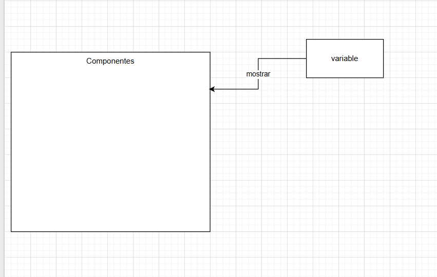
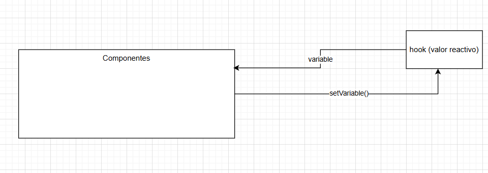
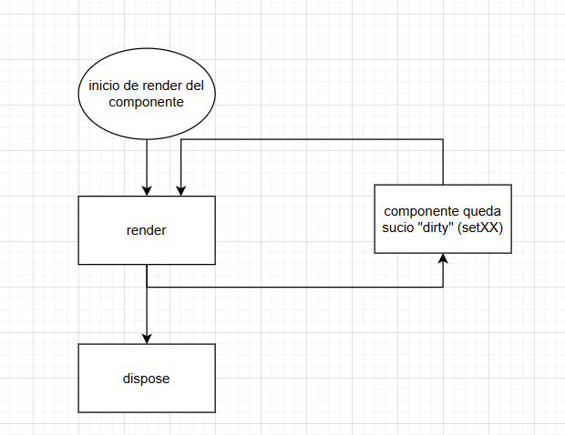
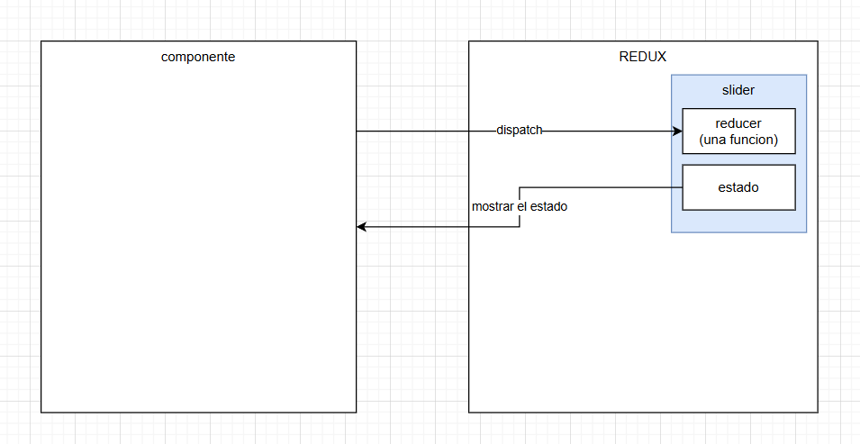
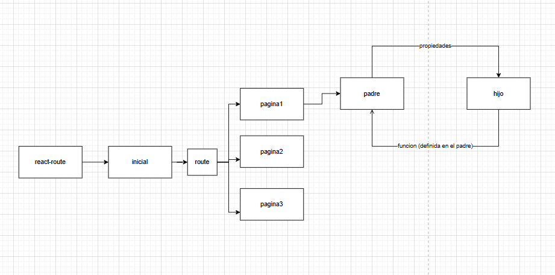

# variables

En React, es posible mostrar una variable dentro del JSX utilizando llaves `{}`. Por ejemplo:

```tsx
const nombre = "Juan";
return <h1>Hola, {nombre}</h1>;
```



> Notas:
> Solo se permite mostrar la variable. Si la variable cambia, no se actualizará automáticamente a menos que se utilice el estado de React.
> Cuando queremos algun valor que no quiero que cambie, conviene ocupar variable.


## reactivos (hook)

Son valores que al ser modificados automáticamente actualizan la interfaz de usuario en React. Esto se logra utilizando el estado de React, generalmente con el hook `useState`. Por ejemplo:

```tsx
const [contador, setContador] = useState(0);
return (
  <div>
    <p>Contador: {contador}</p>
    <button onClick={() => setContador(contador + 1)}>Incrementar</button>
  </div>
);
```



> Notas:
* Solo funcionan dentro de un componente de React.
* Se actualizan automáticamente cuando cambian, a diferencia de las variables normales.
* No interactuan entre otros componentes

## ciclos




## Redux

Redux es una biblioteca para manejar el estado global de una aplicación de React. Permite que diferentes componentes compartan y actualicen el estado de manera centralizada.

>Nota: comunmente se hace para valores reactivos globales que necesitan ser compartidos entre varios componentes.



## Propiedades

En React, las propiedades (props) son valores que se pasan de un componente padre a un componente hijo. Permiten que los componentes sean reutilizables y configurables. Por ejemplo:

```tsx
const Saludo = ({ nombre }: { nombre: string }) => {
  return <h1>Hola, {nombre}</h1>;
};

const App = () => {
  return <Saludo nombre="Juan" />;
};
```



> Notas:
* Las propiedades son de solo lectura dentro del componente hijo.
* Se utilizan para pasar datos y funciones entre componentes.

### Propiedades con funciones

Las propiedades con funciones permiten que un componente hijo ejecute funciones definidas en el componente padre. Esto es útil para manejar eventos o actualizar el estado del componente padre desde el hijo.


